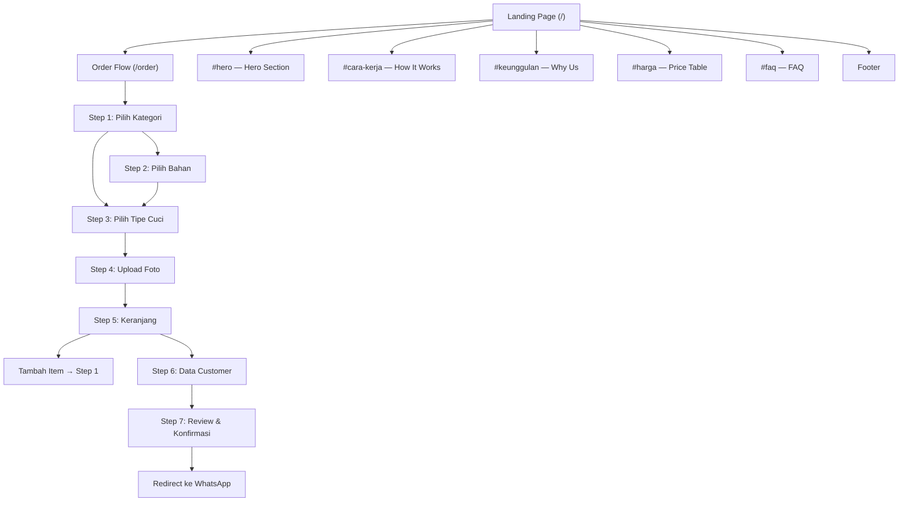

# WashPass — UX Flow & Wireframe Spec

> **Versi:** 1.0  
> **Tanggal:** 25 Agustus 2026

---

## 1. Sitemap



---

## 2. Landing Page — Section Layout

### Mobile Layout (< 768px)
```
┌────────────────────────┐
│ ☰  WashPass     [CTA]  │ ← Navbar (sticky)
├────────────────────────┤
│                        │
│    ✨ HERO SECTION ✨    │
│                        │
│  Sepatu Bersih,        │
│  Tinggal Duduk Manis   │
│                        │
│  [🚀 Pesan Sekarang]   │
│                        │
│  ┌──────────────────┐  │
│  │ 500+ Sepatu Cuci │  │ ← Glassmorphism badge
│  │ ⭐ 4.9 Rating     │  │
│  └──────────────────┘  │
│                        │
├────────────────────────┤
│                        │
│   CARA KERJA           │
│                        │
│   ┌──────────────┐     │
│   │  📱 1. Pesan  │     │
│   └──────┬───────┘     │
│          │             │
│   ┌──────▼───────┐     │
│   │  🚗 2. Jemput │     │
│   └──────┬───────┘     │
│          │             │
│   ┌──────▼───────┐     │
│   │  ✅ 3. Antar  │     │
│   └──────────────┘     │
│                        │
├────────────────────────┤
│                        │
│   KENAPA WASHPASS?     │
│                        │
│   ┌──────────────┐     │
│   │ 🚚 Free P&D  │     │
│   └──────────────┘     │
│   ┌──────────────┐     │
│   │ 👨‍🔧 Profesional│     │
│   └──────────────┘     │
│   ┌──────────────┐     │
│   │ 💰 Transparan │     │
│   └──────────────┘     │
│   ┌──────────────┐     │
│   │ ✅ Garansi    │     │
│   └──────────────┘     │
│                        │
├────────────────────────┤
│                        │
│   DAFTAR HARGA         │
│                        │
│   [Sepatu] [Sandal]    │ ← Tab toggle
│                        │
│   ┌──────────────────┐ │
│   │ Kanvas           │ │
│   │ Kering: Rp35.000 │ │
│   │ Basah:  Rp50.000 │ │
│   └──────────────────┘ │
│   ┌──────────────────┐ │
│   │ Mesh / Knit      │ │
│   │ Kering: Rp40.000 │ │
│   │ Basah:  Rp60.000 │ │
│   └──────────────────┘ │
│   ... dst              │
│                        │
├────────────────────────┤
│                        │
│   FAQ                  │
│                        │
│   ▶ Berapa lama?       │
│   ▶ Bisa cancel?       │
│   ▶ Minimal order?     │
│   ▶ Area layanan?      │
│   ▶ Pembayaran?        │
│                        │
├────────────────────────┤
│                        │
│   FOOTER               │
│   WashPass © 2026      │
│   📱 WhatsApp           │
│   📷 Instagram          │
│                        │
└────────────────────────┘
```

### Desktop Layout (> 1024px)
```
┌──────────────────────────────────────────────────────────┐
│  WashPass     Beranda  Cara Kerja  Harga  FAQ  [Pesan]  │
├──────────────────────────────────────────────────────────┤
│                                                          │
│  ┌─────────────────────┐  ┌────────────────────────┐     │
│  │                     │  │                        │     │
│  │  Sepatu Bersih,     │  │   [Hero Illustration]  │     │
│  │  Tinggal Duduk      │  │                        │     │
│  │  Manis              │  │                        │     │
│  │                     │  │                        │     │
│  │  [🚀 Pesan Sekarang]│  └────────────────────────┘     │
│  │                     │                                 │
│  │  ┌────┐ ┌────┐      │                                 │
│  │  │500+│ │4.9⭐│      │                                 │
│  │  └────┘ └────┘      │                                 │
│  └─────────────────────┘                                 │
│                                                          │
├──────────────────────────────────────────────────────────┤
│                                                          │
│                     CARA KERJA                           │
│                                                          │
│    ┌──────┐     ┌──────┐     ┌──────┐                    │
│    │  📱  │ ──► │  🚗  │ ──► │  ✅  │                    │
│    │Pesan │     │Jemput│     │Antar │                    │
│    └──────┘     └──────┘     └──────┘                    │
│                                                          │
├──────────────────────────────────────────────────────────┤
│                                                          │
│                   KENAPA WASHPASS?                        │
│                                                          │
│  ┌────────┐  ┌────────┐  ┌────────┐  ┌────────┐         │
│  │🚚 P&D  │  │👨‍🔧 Pro  │  │💰 Harga│  │✅ Garansi│         │
│  └────────┘  └────────┘  └────────┘  └────────┘         │
│                                                          │
├──────────────────────────────────────────────────────────┤
│                                                          │
│                     DAFTAR HARGA                         │
│                                                          │
│              [Sepatu]  [Sandal]                          │
│                                                          │
│  ┌──────────────────────────────────────────┐            │
│  │ Bahan          │ Cuci Kering │ Cuci Basah│            │
│  ├──────────────────────────────────────────┤            │
│  │ Kanvas         │ Rp 35.000  │ Rp 50.000 │            │
│  │ Mesh / Knit    │ Rp 40.000  │ Rp 60.000 │            │
│  │ Kulit          │ Rp 50.000  │ Rp 75.000 │            │
│  │ Suede / Nubuck │ Rp 55.000  │ Rp 85.000 │            │
│  └──────────────────────────────────────────┘            │
│                                                          │
└──────────────────────────────────────────────────────────┘
```

---

## 3. Order Flow — Wireframes

### Step Indicator (selalu tampil di atas)
```
Mobile:
┌──────────────────────────────────┐
│  ●───●───○───○───○               │
│  1   2   3   4   5               │
│  Item Detail Tas Data Review     │
└──────────────────────────────────┘

Desktop:
┌──────────────────────────────────────────────────────┐
│  ● Pilih Item ─── ● Detail ─── ○ Keranjang ─── ○ Data ─── ○ Review  │
└──────────────────────────────────────────────────────┘
```

### Step 1 — Pilih Kategori
```
┌──────────────────────────────────┐
│                                  │
│    Mau cuci apa hari ini?        │
│                                  │
│  ┌────────────┐ ┌────────────┐   │
│  │            │ │            │   │
│  │    👟      │ │    🩴      │   │
│  │            │ │            │   │
│  │  SEPATU   │ │  SANDAL    │   │
│  │            │ │            │   │
│  │  mulai    │ │  mulai     │   │
│  │  Rp35.000 │ │  Rp20.000  │   │
│  │            │ │            │   │
│  └────────────┘ └────────────┘   │
│                                  │
└──────────────────────────────────┘
```

### Step 2 — Pilih Bahan (Sepatu)
```
┌──────────────────────────────────┐
│                                  │
│  Terbuat dari bahan apa?         │
│                                  │
│  ┌─────────┐  ┌─────────┐       │
│  │  🧵     │  │  🕸️     │       │
│  │ Kanvas  │  │ Mesh/   │       │
│  │         │  │ Knit    │       │
│  └─────────┘  └─────────┘       │
│                                  │
│  ┌─────────┐  ┌─────────┐       │
│  │  👞     │  │  🦌     │       │
│  │ Kulit   │  │ Suede/  │       │
│  │         │  │ Nubuck  │       │
│  └─────────┘  └─────────┘       │
│                                  │
│  ⓘ Tidak yakin bahannya?        │
│    Pilih yang paling mirip,     │
│    kami akan konfirmasi nanti.  │
│                                  │
└──────────────────────────────────┘
```

### Step 3 — Pilih Tipe Cuci
```
┌──────────────────────────────────┐
│                                  │
│  Pilih tipe pencucian            │
│  Bahan: Kanvas                   │
│                                  │
│  ┌──────────────────────────┐    │
│  │ 🧹 CUCI KERING           │    │
│  │                          │    │
│  │ Pembersihan permukaan    │    │
│  │ tanpa merendam. Cocok    │    │
│  │ untuk perawatan rutin.   │    │
│  │                          │    │
│  │ ⏱️ 1-2 hari              │    │
│  │ 💰 Rp 35.000             │    │
│  │                          │    │
│  │         [Pilih]          │    │
│  └──────────────────────────┘    │
│                                  │
│  ┌──────────────────────────┐    │
│  │ 🫧 CUCI BASAH            │    │
│  │                          │    │
│  │ Pencucian menyeluruh:    │    │
│  │ upper, midsole, outsole, │    │
│  │ insole, tali sepatu.     │    │
│  │                          │    │
│  │ ⏱️ 3-5 hari              │    │
│  │ 💰 Rp 50.000             │    │
│  │                     ⭐    │    │
│  │         [Pilih]     Best │    │
│  └──────────────────────────┘    │
│                                  │
└──────────────────────────────────┘
```

### Step 4 — Upload Foto
```
┌──────────────────────────────────┐
│                                  │
│  Upload foto sepatu              │
│  Agar kami bisa menilai kondisi  │
│                                  │
│  ┌──────────────────────────┐    │
│  │                          │    │
│  │    📷                    │    │
│  │                          │    │
│  │  Seret foto ke sini      │    │
│  │  atau klik untuk upload  │    │
│  │                          │    │
│  │  Max 3 foto, 5MB/foto   │    │
│  │                          │    │
│  └──────────────────────────┘    │
│                                  │
│  Foto yang diupload:            │
│  ┌──────┐ ┌──────┐              │
│  │ img1 │ │ img2 │  [+ Tambah] │
│  │  ✕   │ │  ✕   │              │
│  └──────┘ └──────┘              │
│                                  │
│  Catatan (opsional):            │
│  ┌──────────────────────────┐    │
│  │ Ada noda di bagian...    │    │
│  │                          │    │
│  └──────────────────────────┘    │
│                                  │
│  [Tambahkan ke Keranjang →]     │
│                                  │
└──────────────────────────────────┘
```

### Step 5 — Keranjang
```
┌──────────────────────────────────┐
│                                  │
│  Keranjang Pesanan               │
│  2 / 2 item (minimum terpenuhi) │  ← ✅ Hijau jika ≥ 2
│                                  │
│  ┌──────────────────────────┐    │
│  │ ┌────┐                   │    │
│  │ │foto│ Sepatu — Kanvas   │    │
│  │ └────┘ Cuci Basah        │    │
│  │        Rp 50.000    [🗑️] │    │
│  └──────────────────────────┘    │
│                                  │
│  ┌──────────────────────────┐    │
│  │ ┌────┐                   │    │
│  │ │foto│ Sandal             │    │
│  │ └────┘ Cuci Kering       │    │
│  │        Rp 20.000    [🗑️] │    │
│  └──────────────────────────┘    │
│                                  │
│  [+ Tambah Item Lain]           │
│                                  │
│  ─────────────────────────────  │
│  Total: Rp 70.000               │
│                                  │
│  [← Kembali]  [Lanjut →]       │
│                                  │
└──────────────────────────────────┘

--- Jika kurang dari 2 item: ---

│  ⚠️ Minimal order 2 pasang!     │
│  Silakan tambah 1 item lagi.    │
│                                  │
│  [+ Tambah Item Lain]           │
│                                  │
│  [Lanjut →]  ← disabled/grey   │
```

### Step 6 — Data Customer
```
┌──────────────────────────────────┐
│                                  │
│  Data Diri & Alamat Pickup       │
│                                  │
│  Nama Lengkap *                  │
│  ┌──────────────────────────┐    │
│  │ Ahmad Fauzi              │    │
│  └──────────────────────────┘    │
│                                  │
│  Nomor WhatsApp *                │
│  ┌──────────────────────────┐    │
│  │ 08123456789              │    │
│  └──────────────────────────┘    │
│  ℹ️ Pastikan nomor WA aktif      │
│                                  │
│  Alamat Pickup *                 │
│  ┌──────────────────────────┐    │
│  │ Jl. Merdeka No. 10,     │    │
│  │ Kec. Coblong, Bandung   │    │
│  │                          │    │
│  └──────────────────────────┘    │
│                                  │
│  Catatan Alamat (opsional)       │
│  ┌──────────────────────────┐    │
│  │ Kos warna biru, lt. 2   │    │
│  │                          │    │
│  └──────────────────────────┘    │
│                                  │
│  [← Kembali]  [Review Pesanan →]│
│                                  │
└──────────────────────────────────┘
```

### Step 7 — Review & Konfirmasi
```
┌──────────────────────────────────┐
│                                  │
│  📋 Review Pesanan               │
│                                  │
│  ┌ DATA CUSTOMER ───────────┐    │
│  │ 👤 Ahmad Fauzi            │    │
│  │ 📱 08123456789            │    │
│  │ 📍 Jl. Merdeka No. 10    │    │
│  │    Kos warna biru, lt.2  │    │
│  │              [✏️ Ubah]    │    │
│  └──────────────────────────┘    │
│                                  │
│  ┌ ITEM PESANAN ────────────┐    │
│  │                          │    │
│  │ 1. Sepatu — Kanvas       │    │
│  │    Cuci Basah            │    │
│  │    📸 2 foto              │    │
│  │    Rp 50.000             │    │
│  │                          │    │
│  │ 2. Sandal                │    │
│  │    Cuci Kering           │    │
│  │    📸 1 foto              │    │
│  │    Rp 20.000             │    │
│  │              [✏️ Ubah]    │    │
│  └──────────────────────────┘    │
│                                  │
│  ━━━━━━━━━━━━━━━━━━━━━━━━━━━━━  │
│  Total (2 pasang): Rp 70.000    │
│  ━━━━━━━━━━━━━━━━━━━━━━━━━━━━━  │
│                                  │
│  ┌──────────────────────────┐    │
│  │                          │    │
│  │  📲 Kirim Pesanan via    │    │
│  │     WhatsApp             │    │
│  │                          │    │
│  └──────────────────────────┘    │
│                                  │
│  ℹ️ Pesanan akan disimpan dan    │
│    Anda diarahkan ke WhatsApp   │
│                                  │
└──────────────────────────────────┘

--- Saat submit (loading state): ---

│  ┌──────────────────────────┐    │
│  │                          │    │
│  │  ⏳ Menyimpan pesanan... │    │
│  │                          │    │
│  └──────────────────────────┘    │

--- Jika gagal simpan ke server: ---

│  ⚠️ Gagal menyimpan pesanan.    │
│  Tetap lanjutkan via WhatsApp?  │
│                                  │
│  [Coba Lagi]  [Lanjut ke WA]   │
```

---

## 4. Admin Page — Wireframes

### Admin — Order List (Desktop)
```
┌──────────────────────────────────────────────────────────┐
│  WashPass     [🔑 Admin Panel]                           │
├──────────────────────────────────────────────────────────┤
│                                                          │
│  Daftar Pesanan                            12 pesanan    │
│                                                          │
│  ┌──────────────────────────────────────────────────┐    │
│  │ #  │ Nama        │ WA          │ Item│ Total    │ Tgl       │ Status     │    │
│  ├────┼─────────────┼─────────────┼─────┼──────────┤───────────┤────────────┤    │
│  │ 12 │ Ahmad Fauzi │ 08123456789 │ 3   │ Rp120.000│ 27/08/26  │ 🟡 Pending │    │
│  │ 11 │ Budi S.     │ 08198765432 │ 2   │ Rp 70.000│ 26/08/26  │ 🔵 Process │    │
│  │ 10 │ Citra W.    │ 08112233445 │ 4   │ Rp180.000│ 25/08/26  │ 🟢 Done    │    │
│  │ ...│             │             │     │          │           │            │    │
│  └──────────────────────────────────────────────────┘    │
│                                                          │
└──────────────────────────────────────────────────────────┘
```

### Admin — Order List (Mobile)
```
┌──────────────────────────────────┐
│  WashPass  [Admin]               │
├──────────────────────────────────┤
│                                  │
│  Daftar Pesanan (12)             │
│                                  │
│  ┌──────────────────────────┐    │
│  │ #12 — Ahmad Fauzi        │    │
│  │ 📱 08123456789           │    │
│  │ 3 item · Rp 120.000     │    │
│  │ 27/08/26 · 🟡 Pending   │    │
│  └──────────────────────────┘    │
│                                  │
│  ┌──────────────────────────┐    │
│  │ #11 — Budi S.            │    │
│  │ 📱 08198765432           │    │
│  │ 2 item · Rp 70.000      │    │
│  │ 26/08/26 · 🔵 Processing│    │
│  └──────────────────────────┘    │
│                                  │
│  ┌──────────────────────────┐    │
│  │ #10 — Citra W.           │    │
│  │ 📱 08112233445           │    │
│  │ 4 item · Rp 180.000     │    │
│  │ 25/08/26 · 🟢 Done      │    │
│  └──────────────────────────┘    │
│                                  │
└──────────────────────────────────┘
```

### Admin — Order Detail (Modal / Expanded)
```
┌──────────────────────────────────┐
│                                  │
│  ← Kembali ke Daftar             │
│                                  │
│  Pesanan #12                     │
│  27 Agustus 2026, 14:30          │
│                                  │
│  Status: [▼ Pending     ]       │  ← Dropdown: pending/processing/done
│          [💾 Simpan]             │
│                                  │
│  ┌ DATA CUSTOMER ───────────┐    │
│  │ 👤 Ahmad Fauzi            │    │
│  │ 📱 08123456789  [📲 WA]  │    │  ← Klik untuk buka WA
│  │ 📍 Jl. Merdeka No. 10,   │    │
│  │    Kec. Coblong, Bandung │    │
│  │ 📝 Kos warna biru, lt.2  │    │
│  └──────────────────────────┘    │
│                                  │
│  ┌ ITEM 1 ──────────────────┐    │
│  │ 👟 Sepatu — Kanvas       │    │
│  │ 🧹 Cuci Basah (Deep)     │    │
│  │ 💰 Rp 50.000             │    │
│  │ 📝 Ada noda lumpur       │    │
│  │                          │    │
│  │ Foto:                    │    │
│  │ ┌──────┐ ┌──────┐        │    │
│  │ │ img1 │ │ img2 │        │    │  ← Klik untuk full view
│  │ └──────┘ └──────┘        │    │
│  └──────────────────────────┘    │
│                                  │
│  ┌ ITEM 2 ──────────────────┐    │
│  │ 🩴 Sandal                │    │
│  │ 🧹 Cuci Kering (Fast)    │    │
│  │ 💰 Rp 20.000             │    │
│  │                          │    │
│  │ Foto:                    │    │
│  │ ┌──────┐                 │    │
│  │ │ img1 │                 │    │
│  │ └──────┘                 │    │
│  └──────────────────────────┘    │
│                                  │
│  ┌ ITEM 3 ──────────────────┐    │
│  │ 👟 Sepatu — Kulit        │    │
│  │ 🧹 Cuci Basah (Deep)     │    │
│  │ 💰 Rp 75.000             │    │
│  └──────────────────────────┘    │
│                                  │
│  ━━━━━━━━━━━━━━━━━━━━━━━━━━━━━  │
│  Total (3 pasang): Rp 145.000   │
│  ━━━━━━━━━━━━━━━━━━━━━━━━━━━━━  │
│                                  │
└──────────────────────────────────┘
```

---

## 5. Interaction Notes

### Navigasi Antar Step (Order Flow)
- **Forward:** Tombol "Lanjut" atau klik item (auto-advance setelah pilih)
- **Backward:** Tombol "Kembali" atau klik step indicator
- **Tidak bisa skip step** — harus sequential
- **Step yang sudah diisi bisa diklik di indicator** untuk kembali

### Validasi
- **Real-time inline validation** pada form fields
- **Minimal 2 pasang** dicek di step keranjang
- **Foto opsional tapi disarankan** — tampilkan hint "Foto membantu kami menilai kondisi sepatu"
- **Nomor WA** — validasi format (08xx atau +62)

### Order Submission
- Saat klik "Kirim Pesanan via WhatsApp":
  1. Tampilkan loading state ("Menyimpan pesanan...")
  2. POST ke `/api/orders` (multipart: data + foto)
  3. Jika sukses → generate WA message → redirect ke `wa.me`
  4. Jika gagal → tampilkan opsi "Coba Lagi" atau "Lanjut ke WA saja"
- **Graceful degradation:** Jika server down, WA redirect tetap jalan

### Admin Interactions
- **Klik row/card order** → tampilkan detail (modal atau halaman terpisah)
- **Klik nomor WA** → `wa.me/{nomor}` (buka WhatsApp)
- **Update status** → dropdown + tombol simpan → PATCH API
- **Foto** → klik thumbnail untuk full-size view
- **Auto-refresh** → tidak ada (manual refresh untuk data terbaru)

### Transisi & Animasi
- **Step transition:** Slide left/right (250ms ease)
- **Card selection:** Scale up + border highlight (150ms)
- **Foto upload:** Fade in thumbnail (200ms)
- **Scroll to section:** Smooth scroll (CSS `scroll-behavior: smooth`)
- **Navbar:** Transparent → solid background on scroll (250ms)
- **FAQ accordion:** Max-height transition (300ms)
- **Loading state:** Spinner + disabled button

### Edge Cases
- **User refresh di tengah order:** State hilang (MVP), tampilkan step 1
- **User upload foto > 5MB:** Tolak dengan pesan error friendly
- **User hapus item sampai < 2:** Disable tombol lanjut, tampilkan warning
- **Nomor WA invalid:** Inline error merah
- **Alamat kosong:** Inline error, focus ke field
- **Server down saat submit:** Tampilkan error + opsi lanjut via WA saja
- **Upload foto gagal:** Retry button + pesan error
- **Admin: order list kosong:** Empty state "Belum ada pesanan masuk"
