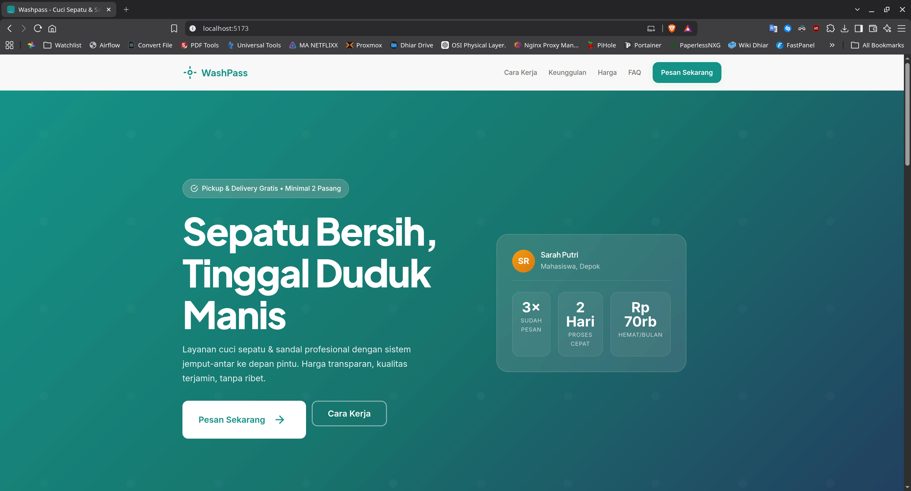
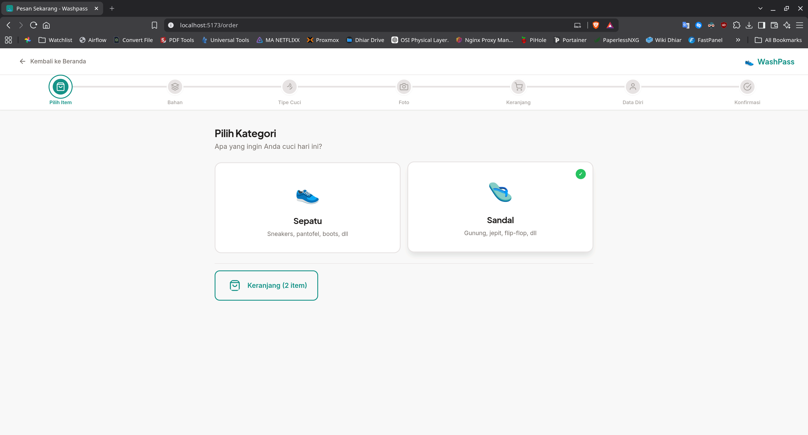
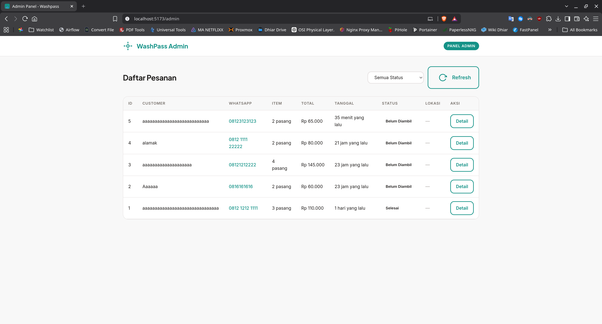

# WashPass

Website jasa cuci sepatu & sandal profesional dengan sistem pickup & delivery.

## Status

**Phase 1-6 Complete** | **Phase 7-8.2 Pending**

See [`docs/CHANGELOG.md`](./docs/CHANGELOG.md) for version history and changelog.

See [`.ai/tasks.md`](./.ai/tasks.md) for detailed feature documentation, known issues, and action items.

## Screenshots

### Landing Page


### Order Flow


### Admin Panel


## Pages

| URL | Description |
|-----|-------------|
| `/` | Landing page |
| `/order` | Order flow |
| `/admin` | Admin panel |
| `/privacy` | Privacy policy |
| `/terms` | Terms & conditions |

## Development

```bash
# Install dependencies
pnpm install

# Development (runs both frontend & backend)
pnpm run dev:all

# Frontend only (Vite dev server on port 5173)
pnpm run dev

# Backend only (Express on port 3000)
pnpm run dev:server

# Production build
pnpm run build

# Production server (serves dist/ + API)
pnpm run start
```

## Tech Stack

- **Frontend**: Vite + Vanilla JS (ES Modules)
- **Backend**: Express.js + SQLite
- **Maps**: Leaflet.js + OpenStreetMap
- **Location**: Browser Geolocation API + Nominatim reverse geocoding
- **CSS**: Vanilla CSS + Custom Properties (Design Tokens)
- **Fonts**: Plus Jakarta Sans + Inter (Google Fonts)

## Next Steps

1. **Phase 7**: Polish (animations, accessibility, SEO, Lighthouse audit)
2. **Phase 8**: Assets (logo, illustrations, OG image, favicon, web manifest)
3. **Phase 9**: Payment Gateway — Midtrans Snap (QRIS, e-wallet, bank transfer)
4. **Production deployment** — Build & deploy to Railway/Render/VPS
